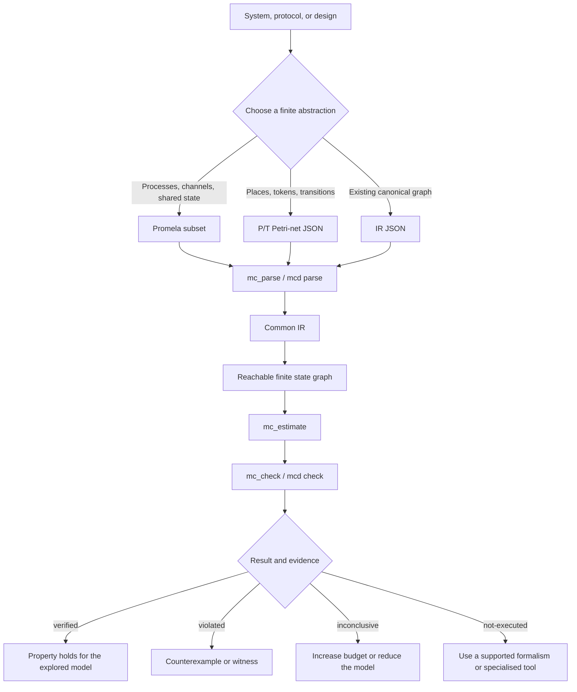
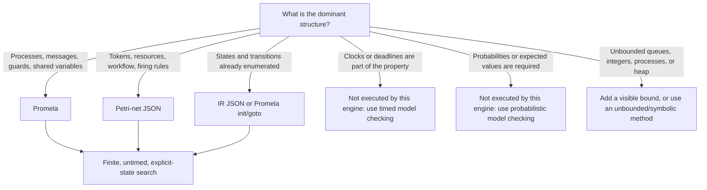
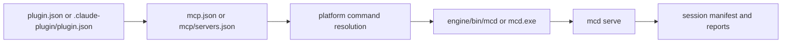

# model-check plugin

`model-check` is an agent plugin for finite explicit-state model checking. It provides an agent skill, a deterministic Go engine, a CLI, and a seven-tool MCP server for Promela models, Petri-net JSON, IR JSON, safety properties, reachability, LTL, CTL, simulation, estimation, counterexamples, and manifests.

This directory is the complete public plugin artifact. Do not distribute only `skills/model-check/`, only `engine/bin/mcd`, or only `mcp/servers.json`; the manifest, engine, features, steps, evaluations, references, build protocol, and release metadata are part of the plugin.

## The model flow in one minute

The plugin checks a **finite model**, not the implementation directly. First choose a
small, explicit abstraction of the system and state what one atomic step means. The
frontend then lowers the input to the common intermediate representation (IR), and
the explicit-state engine explores the reachable state graph. A `verified` result is
therefore a claim about the model, its bounds, its transition semantics, and its
fairness assumptions; it becomes a claim about the implementation only after a
separate conformance argument.



The recommended order is: **model → parse → simulate → estimate → sanity/reachability
checks → safety/deadlock → liveness and fairness → explain every counterexample →
retain the manifest and artifacts**. See [`skills/model-check/SKILL.md`](skills/model-check/SKILL.md)
for the full decision tree and exit conditions.

## Which model should I use?

These are input formalisms, not competing verification algorithms. Promela and Petri
JSON are two ways to describe a system; IR is the normal form shared by both. Choose
the representation that makes the states, transitions, and assumptions easiest to
review.

| Model or notation | What it represents | Use it when | Particularly useful checks | Important boundary |
|---|---|---|---|---|
| **Promela subset** (`.pml`) | Concurrent processes, program locations, finite variables, shared state, FIFO channels, rendezvous, and nondeterministic interleaving | The system is a protocol or concurrent program with message exchange and process control flow | Mutual exclusion, races in the abstraction, deadlocks, reachability, response properties, progress, LTL, CTL, and weak-fairness questions | Only the documented subset is accepted; time, probability, embedded C, and unbounded data are outside this engine |
| **P/T Petri net** (JSON) | Places hold tokens; transitions fire when their input markings are available; a marking is the state | The problem is naturally about resources, workflow, causal concurrency, or token flow | Reachable hangs/deadlocks, place safety, boundedness, resource conflicts, and reachability of a marking | The frontend accepts basic place/transition nets; inhibitor arcs are rejected, and coloured/timed features require an explicit lossy translation |
| **Canonical IR** (JSON) | The engine's finite state variables, control locations, transitions, and properties after parsing | A tool needs a stable interchange format, custom properties, or reproducible debugging | Re-running a parsed model, inspecting the lowering, and attaching explicit invariant/reachability properties | Prefer generating IR with `mc_parse`/`mcd parse`; direct authoring is an advanced interface and must respect `mcd-ir/1` |
| **Automata/program abstraction** | A finite control graph plus bounded data and labelled actions | The source design is already an FSM, EFSM, statechart, or automata program | State coverage, illegal transitions, deadlock, recovery, and temporal response | Map each source event and atomic action explicitly to the model; the result is about that mapping |

### Model choice at a glance



A protocol can contain a timeout and still be an untimed model when `timeout` means
“no ordinary action is currently executable”. It becomes a timed-model question only
when the requirement says *within five seconds*, uses clocks, or otherwise depends on
elapsed time. The same distinction applies to “rarely”: it is a safety question if it
means “never”, but a probabilistic question if it asks for a probability.

## Plugin deployment flow

The two plugin declaration families select the same server contract. The portable
manifest uses `${PLUGIN_ROOT}`; the Claude manifest uses `${CLAUDE_PLUGIN_ROOT}`.
The shipped `mcd.exe` alias lets Windows resolve the same command name, while the
POSIX wrapper selects the matching native binary on Unix.



## What should I check?

The input model and the property logic answer different questions. Start with a small
safety or reachability check to validate the abstraction, then move to liveness only
after the trigger, atomic step, and fairness assumptions are explicit.

| User question | Property to prefer | Evidence to expect | Typical example |
|---|---|---|---|
| “Can the system ever reach a bad state?” | `reach` or an invariant/safety property | A finite witness for reachability, or a finite bad prefix for a violation | `cnt > 1`, both processes in a critical section |
| “Can the system get stuck?” | `deadlock` | A finite counterexample ending in a state with no executable transition | A producer and consumer both waiting |
| “Is this always safe?” | `invariant` | Exhaustive reachable-state search for `verified`; a finite counterexample for `violated` | `!(cs1 && cs2)`, every place has at most one token |
| “Will every request eventually receive a response?” | LTL, for example `[](request -> <> response)` | Usually a finite prefix plus a lasso when the liveness property is violated | A request that can be postponed forever |
| “From every state, is recovery possible along some continuation?” | CTL, for example `AG EF recovered` | A branching-state witness/counterexample, not necessarily one linear trace | Every reachable failure state has a route back to idle |
| “Does useful work continue forever?” | `progress` or LTL recurrence, with an explicit fairness decision | A non-progress lasso, or exhaustive absence of one under the stated assumptions | A scheduler can spin without visiting a progress label |
| “How large will the search be?” | `mc_estimate` before verification | Approximate growth data, never a verification verdict | Choose state, depth, time, and memory budgets |

LTL and CTL are deliberately not interchangeable. LTL describes every complete path
as a sequence; CTL can quantify over the branching set of continuations. For example,
`AG EF reset` means that every reachable state has *some* path to `reset`, whereas
`[]<> reset` requires every path to visit `reset` infinitely often. Liveness may need a
justified weak-fairness assumption; the report must name it rather than silently
discarding an unfair counterexample.

## Contents

- `plugin.json` — portable Agent Plugins 1.0 metadata.
- `.claude-plugin/plugin.json` — Claude Code compatibility metadata and reference to `./mcp/servers.json`.
- `engine/` — Go module `modelcheck`, source packages, tests, fixtures, CLI, MCP server, and release binaries.
- `features/` — Gherkin scenarios for the engine layers and integration tracks.
- `steps/` — confirmation records, logical reviews, MCP sessions, and evaluation evidence.
- `mcp.json` — portable stdio MCP server declaration using `${PLUGIN_ROOT}`.
- `mcp/servers.json` — Claude Code stdio MCP server declaration using `${CLAUDE_PLUGIN_ROOT}`.
- `skills/model-check/` — `SKILL.md`, workflows, property guidance, format references, assets, and report templates.
- `evals-workspace/` — evaluation fixtures, graders, benchmark runs, and review data when included in the release.
- `BUILD-PROTOCOL.md` — the six-part step protocol (scenarios first, tests, logic review, confirmation record); the build itself is documented in the build section below and in `build.sh`.
- `AGENT-COMMON.md` — shared historical build-agent guidance.
- `build.sh` — reproducible multi-platform build and release verification script.

## Requirements

### Runtime

A ready-made release needs an agent/plugin host that supports the plugin manifest and MCP stdio servers. It does not need Go or SPIN at runtime. The selected platform needs the corresponding executable under `engine/bin/`:

- POSIX systems use the `engine/bin/mcd` wrapper, which selects `mcd-<goos>-<goarch>` using `uname`.
- Windows uses `engine/bin/mcd.exe` (the file the portable `engine/bin/mcd` command resolves to; a byte copy of `mcd-windows-amd64.exe`), the `engine/bin/mcd.cmd` wrapper where a host needs a batch file, and `mcd-windows-amd64.exe`.

### Build and test

- Go 1.26, declared in `engine/go.mod`.
- Python 3, required by `build.sh` and release metadata generation.
- A POSIX shell for `build.sh`.
- SPIN 6.5.2 or a compatible installation for SPIN-dependent tests and comparisons.
- Git for source-commit identification and release review.

SPIN is a test/comparison dependency, not a runtime dependency of an already-built `mcd` binary.

## Installation

### Obtain the public plugin

Use the public `model-check-plugin` project/repository or the complete `model-check-plugin/` directory from a reviewed release. Keep the directory layout intact; in particular, do not move `engine/bin`, `skills`, or `mcp` out of the plugin root.

### Build if binaries are not included

From the plugin root:

```bash
./build.sh --host-only --version 0.2.0
engine/bin/mcd version
```

For a release containing all configured platforms, use the full build described below. Do not silently replace a missing binary with an executable from another checkout.

### Register with the agent host

Point the plugin host at the plugin root using its documented installation mechanism. For local Claude Code development, use:

```bash
claude --plugin-dir /path/to/model-check-plugin
```

Confirm the following before starting a verification session:

1. `plugin.json` and `mcp.json` are present for portable Agent Plugins hosts.
2. `.claude-plugin/plugin.json` exists for Claude Code and names `./skills` and `./mcp/servers.json`.
3. `mcp.json` resolves `${PLUGIN_ROOT}/engine/bin/mcd`; Claude Code's `mcp/servers.json` resolves `${CLAUDE_PLUGIN_ROOT}/engine/bin/mcd`.
4. The selected binary is executable and matches the host platform.
5. The host shows one `model-check` MCP server, not a duplicate project-level registration.

The server belongs in `mcp/servers.json`. Do not add a second root `.mcp.json` for this plugin: that can register the same server twice and leave `${CLAUDE_PLUGIN_ROOT}` unset in the duplicate registration.

### Codex CLI and Coddy

The plugin also ships agent-facing integration files for Codex and Coddy:

- `AGENTS.md` is the portable Codex project-instruction file.
- `.codex/README.md` documents Codex skill and MCP registration.
- `.coddy/mcp.json` declares the project-local Coddy MCP server using `${CWD}`.
- `.coddy/README.md` documents Coddy trust and skill installation.

Codex does not consume the Claude Code plugin manifest as a native plugin. From the
plugin root, expose the skill and register the bundled MCP server as follows:

```bash
mkdir -p "${CODEX_HOME:-$HOME/.codex}/skills"
ln -sfn "$PWD/skills/model-check" \
  "${CODEX_HOME:-$HOME/.codex}/skills/model-check"
codex mcp add model-check -- \
  "$PWD/engine/bin/mcd" serve \
  --max-states 5000000 --max-depth 5000000 --max-ms 300000 \
  --max-memory-mb 2048 --concurrency 2
codex mcp get model-check
```

Coddy can install the skill from the public source and use the project-local MCP
declaration when the plugin checkout is the workspace:

```bash
coddy plugin install https://github.com/viktor-drobek/model-check-plugin.git
cd /path/to/model-check-plugin
coddy mcp list --cwd "$PWD"
coddy mcp trust model-check --cwd "$PWD"
coddy --dry-run
```

Project-local Coddy MCP declarations are untrusted by default. Approve only the
exact command you intend to run. Keep one `model-check` registration; do not add a
second `.mcp.json` or duplicate global server entry. `coddy --dry-run` also probes
other global MCP servers, so an unrelated global timeout is not a failure of this
local declaration; inspect the local row with `coddy mcp list --cwd`.

### Smoke test

```bash
engine/bin/mcd version
engine/bin/mcd parse --promela "../Promela - examples/CH2/mutex.pml"
```

The second command assumes the plugin is inside the monorepo. In a standalone plugin checkout, use an absolute or otherwise valid path to a model file, or provide the model inline through MCP.

## Prepare and build

Run the checks from a clean, reviewed checkout. Do not include credentials, private absolute paths, Python bytecode, temporary SPIN output, or accidental host data in a release.

### Test and lint

```bash
cd engine
go test ./...
go vet ./...
test -z "$(gofmt -l .)"
spin --version
cd ..
```

The suite includes Go unit tests and the Godog harness. CI additionally runs the race detector and verifies SPIN on the configured self-hosted runner.

Performance work is measured, not asserted. The whole-engine benchmarks run the Promela fixtures `engine/testdata/promela/bench-*.pml` through `cli.Run` and check their state counts, so a faster engine that explores something else fails:

```bash
cd engine
go test -run XXX -bench . -benchmem ./explore .
```

Compare two revisions by running both test binaries alternately on one machine; a single run varies by about 10%.

### Partial-order reduction (`--por`)

`mcd check --por` explores, in a state, the moves of one process alone when the analysis can prove that nothing the other processes do could matter first. It applies to the safety search only (`deadlock`, `assert`, `invariant`, `reach`), depth-first, and it is opt-in. The verdicts are the same as without it; the number of states and transitions in the report are those of the *reduced* graph (so they no longer match `pan -c0`), and the first counterexample can differ. The report's `search.reduction` says whether the reduction was applied and, when it was not, why: atomic sequences, rendezvous or dynamic channels, `run`, a read of the process table (`_nr_pr`), `timeout`, `provided`, `--bfs`, and any `ltl`, `progress` or `ctl` property are refused in this version. A producer and its consumer do not make a conflict: the send end and the receive end of a buffered channel are separate, and a process at a channel operation is expanded alone only while the channel can act (room for a send, a message for a receive), so a pipeline of stages is explored stage after stage. The MCP tool `mc_check` takes the same request as `por: true` and answers with the same `search.reduction`; a request it cannot honour is a result with `applied: false`, not a tool error.

The reduction is checked against the unreduced search by `explore/por_random_test.go` (8000 random models, with and without d_step, dead-end locations and guards on program counters; for the models on which both searches finish, which is most of them, the verdicts, the set of states without an enabled move, and every counterexample replayed as a run of the model, and for all of them whether a model error is reachable; `MCD_POR_MODELS=60000` for a deeper one-off run), by `por_corpus_test.go` at the root of the `engine` module (the Promela models of `testdata/promela`, `testdata/corpus2` and the SPIN corpus that the frontend accepts and both searches finish: the status and evidence of each property, the reachability of a model error, and a state count that is never larger, and equal when the reduction is refused), and by the scenarios of `features/g7-por.feature`. `go test ./explore -run TestPOR` runs the first and the analysis tests in seconds.

### Reproducible release build

```bash
./build.sh --version 0.2.0 --source-commit <SOURCE-COMMIT> --verify-repro
```

`<SOURCE-COMMIT>` is the commit the engine sources are built from. For a release it is the commit just before the one that commits the built files under `engine/bin/` (the artifacts commit), because a commit cannot name itself; `BUILD-INFO.json` records it as `source_commit`. Without `--source-commit` the script records `git rev-parse HEAD` of the plugin checkout (or `unknown` outside a Git checkout), which after the artifacts commit is the artifacts commit, so the committed `BUILD-INFO.json` is not reproduced from that checkout.

The script:

- builds static `mcd` binaries for Linux amd64/arm64, Darwin amd64/arm64, and Windows amd64 by default;
- writes the POSIX `mcd` wrapper, the Windows `mcd.cmd` wrapper, and `mcd.exe`, a copy of the Windows binary;
- writes sorted `engine/bin/SHA256SUMS`;
- writes `engine/bin/BUILD-INFO.json` with version, Go version, flags, source commit, platforms, and binary sizes;
- checks the host binary, wrapper, checksums, and version stamp;
- performs a second build when `--verify-repro` is supplied and compares every generated file (binaries, wrappers, `SHA256SUMS`, `BUILD-INFO.json`) byte for byte.

For a faster local build:

```bash
./build.sh --host-only --version 0.2.0
```

Useful options are `--source-commit HASH`, `--platforms "goos/goarch ..."`, `--out DIR`, `--no-verify`, and `--verify-repro`; the options and exit codes are listed at the top of `build.sh`. Use `--no-verify` only for an intentional intermediate build. Record which platforms were built and which were actually smoke-tested; cross-building is not the same as executing a platform binary.

After a release build:

```bash
engine/bin/mcd version
( cd engine/bin && sha256sum -c SHA256SUMS )
cat engine/bin/BUILD-INFO.json
```

The build and its options are described in this section and at the top of `build.sh`. [`BUILD-PROTOCOL.md`](BUILD-PROTOCOL.md) is the six-part protocol every development step follows (scenarios first, tests, logic review, confirmation record), not a build manual; the record of a release is a `steps/*-confirmation.md` file (for 0.2.0, the addendum at the top of `steps/g6-confirmation.md`).

## Use the CLI

The CLI is `engine/bin/mcd`. It can also be built or run with `go run ./cmd/mcd` from `engine/`.

```bash
# Parse Promela into canonical IR JSON.
engine/bin/mcd parse --promela /path/to/model.pml

# Check a Promela model with a bounded breadth-first search.
engine/bin/mcd check \
  --promela /path/to/model.pml \
  --bfs \
  --budget-states 100000 \
  --no-timing

# Parse Petri-net JSON or IR JSON.
engine/bin/mcd parse --petri /path/to/net.json
engine/bin/mcd parse --ir /path/to/model.json

# Check LTL or CTL formulas from the command line.
engine/bin/mcd check --promela /path/to/model.pml --ltl '[] (request -> <> response)'
engine/bin/mcd check --promela /path/to/model.pml --ctl 'AG (count <= 1)'

# Start the MCP server manually when the host is not launching it.
engine/bin/mcd serve --session-dir ${TMP_DIR}/mcd-sessions
```

The accepted Promela subset is documented in [`skills/model-check/references/promela-subset.md`](skills/model-check/references/promela-subset.md). Read it before interpreting an `outside-subset` rejection. The engine is finite and explicit-state: it does not provide timed, probabilistic, symbolic, or unbounded verification.

### Result vocabulary

Always report the result and its evidence separately:

| Status | Meaning |
|---|---|
| `verified` | The property was established under the stated model and search assumptions. For ordinary verification this requires complete exhaustive evidence. |
| `violated` | A counterexample or other exact refutation was found. |
| `inconclusive` | A budget stopped the search before the property was decided. |
| `unknown` | The result cannot be classified more strongly under the engine's evidence contract. |
| `not-executed` | The property or input was not executed, for example because the construct is outside the supported subset. |
| `invalid-model` | Execution found a domain/model defect such as an overflow or invalid state. |

Evidence is one of `exhaustive`, `bounded`, `approximate`, or `unknown`. A time or memory stop is not an exhaustive result. Read the search stop reason, budgets, warnings, assumptions, counterexample/witness, and generated artifact paths before making a claim.

## Use the MCP server

The manifest starts this stdio command:

```text
${CLAUDE_PLUGIN_ROOT}/engine/bin/mcd serve --max-states 5000000 --max-depth 5000000 --max-ms 300000 --max-memory-mb 2048 --concurrency 2
```

The seven MCP tools are:

- `mc_parse` — parse Promela, Petri JSON, IR JSON, or an allowed file into IR;
- `mc_simulate` — run a seeded random or guided sanity walk;
- `mc_check` — check invariant, deadlock, reachability, LTL, CTL, and progress properties;
- `mc_explain` — decode a stored counterexample or witness;
- `mc_lint_property` — inspect property atoms, types, classes, and temporal normalisation;
- `mc_estimate` — estimate state-space growth and select a budget;
- `mc_manifest` — emit the session manifest with versions, hashes, calls, and artifacts.

The recommended workflow is:

1. Parse the model with `mc_parse`.
2. Run a short fixed-seed `mc_simulate` sanity walk.
3. Use `mc_estimate` to understand growth and budget needs.
4. Check reachability, safety, and deadlock properties.
5. Check liveness and fairness assumptions separately.
6. Use `mc_explain` for every reported counterexample.
7. Read `mc_manifest` and retain the session artifacts with the report.

The agent skill in [`skills/model-check/SKILL.md`](skills/model-check/SKILL.md) defines the complete intake, staged execution, interpretation, and reporting procedure. It is the source of operational guidance; this README is an installation and orientation summary.

## Files, sessions, and safety

MCP sessions write IR, check, simulation, counterexample, and manifest artifacts under the configured session directory. The server applies path guards and an optional read allow-list. Do not pass arbitrary host paths, interpolate model text into shell commands, or copy models and traces containing sensitive data into public examples.

For CLI use, create a separate session directory and preserve the input, command line, report, and relevant traces. Never overwrite the user's source model. Treat reports and traces as potentially sensitive.

## Troubleshooting

### `mcd` is missing or not executable

Build the host binary with `./build.sh --host-only --version <VERSION>`, check the executable bit on `engine/bin/mcd`, and run `engine/bin/mcd version`. Confirm that the wrapper's selected `mcd-<goos>-<goarch>` file exists.

### The MCP server is listed twice or is pending approval

Remove the extra project-level MCP registration. Keep the plugin declaration in `mcp/servers.json`, ensure the plugin host sets `${CLAUDE_PLUGIN_ROOT}`, and restart the host so it reloads the manifest.

### The model is rejected

Read the `kind`, source location, and reason in the rejection. Check the accepted Promela subset and Petri-net schema. A rejected input is not a verification verdict; rewrite the model or property and run `mc_parse` again.

### The result is inconclusive

Read the exhausted resource. Use `mc_estimate`, reduce the model only with that change documented, or increase a states/depth/time/memory budget deliberately. Do not relabel `inconclusive` as `verified`.

### A SPIN-dependent check fails

Confirm `spin --version`, verify that SPIN is on `PATH`, and inspect the relevant `features/` and `steps/` confirmation record. SPIN is required for comparison/test paths, not for ordinary use of a ready-made binary.

### A build checksum or reproducibility check fails

Start from a clean checkout, use the declared Go toolchain and `GOTOOLCHAIN=local`, remove only generated `engine/bin` outputs, rebuild with the same version and platform arguments, and inspect `BUILD-INFO.json`. Do not publish a release whose checksum or reproducibility check fails.

## Public release checklist

Before publishing this plugin:

- preserve the complete versioned `model-check-plugin/` tree;
- validate `plugin.json`, `mcp.json`, `.claude-plugin/plugin.json`, and `mcp/servers.json`;
- run `go test ./...`, `go vet ./...`, formatting, and SPIN checks;
- run `./build.sh --version <VERSION> --source-commit <SOURCE-COMMIT> --verify-repro`;
- verify `engine/bin/SHA256SUMS`, `BUILD-INFO.json`, the host wrapper, and platform records;
- check all examples and logs for private paths, secrets, tokens, and host data;
- update installation, preparation, build, usage, tooling, limitations, troubleshooting, and provenance instructions in the same change;
- include the source commit and version in the release record.

## Literature and provenance

The public bibliography and the complete source map live in
[`PROVENANCE.md`](PROVENANCE.md). It distinguishes external publications from
reading notes that exist only in the full monorepo, so a standalone plugin checkout
does not contain broken local links.

Key public references are:

- Clarke, Henzinger, Veith, and Bloem (eds.), [*Handbook of Model
  Checking*](https://link.springer.com/book/10.1007/978-3-319-10575-8), for the
  modern model-checking taxonomy and algorithms.
- Clarke, Grumberg, and Peled, [*Model Checking*](https://link.springer.com/book/10.1007/978-3-662-22679-3), for the classic transition-system and temporal
  model-checking treatment.
- Baier and Katoen, [*Principles of Model Checking*](https://mitpress.mit.edu/9780262026499/principles-of-model-checking/), for LTL/CTL terminology,
  safety/liveness, fairness, and state-space reasoning.
- Holzmann, [*Design and Validation of Computer Protocols*](http://spinroot.com/gerard/popd.html), and [the SPIN project](https://spinroot.com/), for Promela and
  protocol verification.
- Karpov, [*Model Checking*](https://books.google.com/books/about/MODEL_%D0%A1HECKING_%D0%92%D0%B5%D1%80%D0%B8%D1%84%D0%B8%D0%BA%D0%B0%D1%86%D0%B8%D1%8F.html?id=xpui56eRsHgC), for Russian-language terminology and examples.

These sources provide background and provenance, not an implementation guarantee.
The current engine behavior is defined by the Go code, feature scenarios, and the
executable references under `skills/model-check/references/`. Unsupported timed,
probabilistic, symbolic, unbounded, or game semantics must remain explicitly
outside this plugin's scope.
